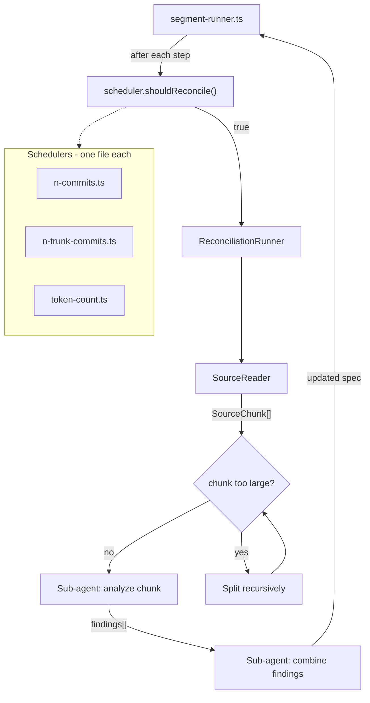

# Reconciliation Checkpoints + Multi-File Spec

Two-phase plan. Phase 1 (reconciliation) is self-contained and testable on the fixture repo. Phase 2 (spec splitting) is required for real-world scale and builds on Phase 1.

---

## Phase 1: Reconciliation Checkpoints

### Architecture




### Scheduler Interface

New file: `src/reconciliation/scheduler.ts`

```typescript
export interface ReconciliationContext {
  totalStepsCompleted: number;
  trunkStepsCompleted: number;
  cumulativeDiffTokensSinceLastReconciliation: number;
  segmentType: "trunk" | "branch" | "dead-end";
  lastReconciliationStep: number;
}

export interface ReconciliationScheduler {
  shouldReconcile(ctx: ReconciliationContext): boolean;
}

export function createScheduler(config: EvolutionConfig): ReconciliationScheduler;
```

### Scheduler Implementations (one file each)

- `src/reconciliation/schedulers/n-commits.ts` — fires when `totalStepsCompleted - lastReconciliationStep >= interval`
- `src/reconciliation/schedulers/n-trunk-commits.ts` — same but only counts steps where `segmentType === "trunk"`
- `src/reconciliation/schedulers/token-count.ts` — fires when `cumulativeDiffTokensSinceLastReconciliation >= interval` (interval is a token threshold)

Each exports a class implementing `ReconciliationScheduler`. The factory in `scheduler.ts` imports them.

### Source Tree Reader

New file: `src/reconciliation/source-reader.ts`

**Two modes of operation:**

1. **Initial reconciliation** (`readTree(sha)`): When `lastReconciliationSha` is not present in state
  - `git ls-tree -r --name-only <sha>` to get all files
  - Full tree scan with safety valve: abort if total source tokens exceed `maxSourceTokens` config
  - Filter with `sourceIgnorePatterns` (tests, configs, lockfiles, generated code, assets, minified bundles)
  - Files exceeding `maxFileTokens` threshold are NOT skipped entirely. Instead, they are split into chunks by line ranges (e.g., every N lines that fit within `maxFileTokens`). Each chunk becomes its own `SourceFile` entry with a path suffix indicating the range (e.g., `src/big-file.ts:1-500`, `src/big-file.ts:501-1000`). Line-range chunking is a simple heuristic; future enhancement could use AST-based splitting for better semantic boundaries.
  - The `skippedFiles` field in `SourceReadResult` is retained for files that cannot be read at all (permissions, binary, etc.), but oversized text files are chunked, not skipped. **CRITICAL**: Skipped files MUST be logged as warnings and included in the reconciliation output metadata (e.g., `skippedFiles: string[]` in the runner result) to ensure users are aware when important files are excluded
  - Group by directory using `getGroupKey()` logic from [diff-chunker.ts](src/evolution/diff-chunker.ts)
  - For each group, estimate total tokens
  - If a group exceeds `maxDiffTokens`, recursively subdivide into deeper directory levels (same recursive split logic as `splitOversizedChunks`)
  - NOTE: `maxDiffTokens` is inherited from the existing `EvolutionConfig` (already used by diff-chunker.ts) and is NOT a new field in the reconciliation config
  - Read file contents via `git show <sha>:<path>` (batched per chunk to avoid N+1)
2. **Incremental reconciliation** (`readDiff(fromSha, toSha)`): When `lastReconciliationSha` exists
  - **Safety step**: Before loading the full diff, run `git diff --stat <lastReconciliationSha>...<currentSha>` to estimate diff size
  - If the estimated diff size exceeds `maxSourceTokens`, fall back to `readTree(currentSha)` mode (full tree scan), which already supports chunking and the `maxSourceTokens` safety valve for total tree size. This prevents the "death spiral" where repeated aborts prevent `lastReconciliationSha` from advancing.
  - If `readTree(currentSha)` also aborts (tree too large), THEN abort reconciliation AND advance `lastReconciliationSha` to `currentSha` anyway, to prevent accumulation. Log a warning that reconciliation was skipped due to size limits.
  - Otherwise, proceed with `git diff <lastReconciliationSha>...<currentSha>` to get only changed files
  - Process diff hunks grouped by directory (same recursive chunking/splitting logic as full tree mode)
  - Chunks contain diff hunks grouped by directory rather than full file contents
  - More efficient for large codebases as only changed files are analyzed

The runner checks for `lastReconciliationSha` in state and picks the appropriate reader mode.

Returns `SourceReadResult`:

```typescript
export interface SourceFile {
  path: string;
  content: string;
  tokens: number;
}
export interface SourceChunk {
  groupKey: string;
  files: SourceFile[];
  totalTokens: number;
}
export interface SourceReadResult {
  chunks: SourceChunk[];
  skippedFiles: string[];  // files that cannot be read at all (permissions, binary, etc.) - oversized text files are chunked, not skipped
}
```

Note: For diff-based mode, chunks contain diff hunks grouped by directory rather than full file contents, using the same recursive chunking/splitting logic.

### Reconciliation Runner

New file: `src/reconciliation/runner.ts`

**Recursive sub-agent dispatch** — each stage uses sub-agents:

```
runReconciliation(currentSpec, commitSha, config, lastReconciliationSha)
  |
  +-- if lastReconciliationSha exists:
  |     SourceReader.readDiff(lastReconciliationSha, commitSha)  -->  SourceReadResult
  |     (on abort: fall back to readTree(commitSha); if that also aborts, advance lastReconciliationSha anyway)
  |   else:
  |     SourceReader.readTree(commitSha)  -->  SourceReadResult
  |
  +-- Propagate skippedFiles from SourceReadResult to reconciliation output metadata
  |
  +-- for each chunk in SourceReadResult.chunks (parallel, bounded by maxConcurrency):
  |     invokeClaudeForChunk(spec + chunk source + skippedFiles)
  |       --> { findings: ReconciliationFinding[], sectionsAffected: string[], usage: { inputTokens: number, outputTokens: number } }
  |     (The runner aggregates usage across all sub-agent calls to compute total costUsd for state tracking)
  |
  +-- if total findings exceed maxDiffTokens:
  |     batch findings into groups that fit within maxDiffTokens
  |     **Batch ordering**: Sort findings so that "addition" and "modification" types are applied before "removal" types. This ensures new content is established before old content is pruned.
  |     apply batches sequentially: Spec -> Apply Batch 1 -> Spec' -> Apply Batch 2 -> Spec'' -> ...
  |     each application uses invokeClaudeForRecombine(currentSpec + batchFindings + upcomingBatchSummary)
  |     **Batch context**: Each sequential Recombine call receives a brief summary of remaining batches (e.g., "Upcoming batches contain N additions and M removals affecting sections: [list]"). This gives the LLM context to avoid premature deletions.
  |   else:
  |     invokeClaudeForRecombine(spec + all findings)
        --> { updatedSpec: string, additions: ReconciliationFinding[], removals: ReconciliationFinding[] }
```

Where `ReconciliationFinding` is:

```typescript
interface ReconciliationFinding {
  type: "addition" | "removal" | "modification";
  specSection: string;
  description: string;
  sourcePaths: string[];
}
```

Key rules:

- Analysis sub-agents use `config.defaultModel` (Sonnet) — there are many of them
- The final recombine step uses `config.reconciliation.model` (defaults to Opus) — single high-stakes call
- If recombine input exceeds token limit, recursively group findings and do intermediate combines before the final combine (same pattern as diff chunking)
- Parallel sub-agent calls use retry with exponential backoff for rate limit (429) and transient errors. The runner delegates retry semantics to the underlying API client (existing Anthropic client handles this)

### Prompt Templates

`prompts/reconcile-chunk.md`:

- "Here is the current Allium spec and a source package (or diff). Identify domain rules, behaviors, relationships, or entity fields that exist in the source but are missing from the spec (additions), AND identify spec sections that reference code that no longer exists in the source (removals)."
- Prompt context includes `skippedFiles: string[]` — files excluded from this analysis due to size limits (exceeding maxFileTokens). **CRITICAL**: Do NOT treat these skipped files as removed — ignore these paths when identifying removals. These files were excluded from analysis, not deleted from the codebase.
- Must output both additions (missing from spec) and removals (in spec but no longer in source)
- Must NOT restructure existing spec
- Output schema: `{ findings: ReconciliationFinding[], sectionsAffected: string[] }`
- The LLM must output structured findings matching the `ReconciliationFinding` interface (type, specSection, description, sourcePaths)

`prompts/reconcile-combine.md`:

- "Here is the current spec and findings from source analysis. Integrate the findings into the spec: add missing elements and remove obsolete elements."
- Must preserve existing spec structure, add identified gaps and remove obsolete references
- Must maintain the evolving header comment
- Output schema: `{ updatedSpec: string, additions: ReconciliationFinding[], removals: ReconciliationFinding[] }`

### Config Changes

In `src/config.ts`, add to `EvolutionConfig`:

```typescript
reconciliation: {
  strategy: "none" | "n-commits" | "n-trunk-commits" | "token-count";
  interval: number;               // default 50
  model?: string;                 // defaults to opusModel
  sourceIgnorePatterns: string[];  // default: ["*.test.*", "*.spec.*", "*.config.*", "package-lock.json", "yarn.lock", "pnpm-lock.yaml", "*.min.js", "*.min.css", "*.bundle.js", "*.map"]
  maxConcurrency: number;          // default 5
  maxSourceTokens?: number;         // safety valve for initial full tree scan (abort if exceeded)
  maxFileTokens?: number;          // skip individual files exceeding this threshold
};
```

NOTE: `maxDiffTokens` is inherited from the existing `EvolutionConfig` (already used by diff-chunker.ts) and is NOT a new field in the reconciliation config.

CLI flags in `src/cli.ts`:

- `--reconciliation-strategy <strategy>` (default: `"n-trunk-commits"`; set to `"none"` to disable reconciliation)
- `--reconciliation-interval <n>` (default: `50`)

### Integration in Segment Runner

In `src/evolution/segment-runner.ts`, after each step (after the `onStepComplete` callback):

1. Accumulate `cumulativeDiffTokens` from `context.totalDiffTokens`
2. Build `ReconciliationContext` and call `scheduler.shouldReconcile(ctx)`
3. If triggered:
  - Call `runReconciliation({ currentSpec, commitSha, config, lastReconciliationSha })`
  - Replace `currentSpec` with reconciled spec (held in memory)
  - Reset counters via `stateTracker.recordReconciliation(commitSha)`
  - **CRITICAL**: The reconciled spec replaces the step's spec output BEFORE the allium commit is finalized. The allium commit for this step captures BOTH the reconciled spec AND the reconciliation metadata in its commit message:
    ```
    Reconciliation: source-grounded at <sha8>
    Findings: <n> additions, <m> removals
    Reconciliation cost: $<amount>
    ```
4. **Persistence model**: The reconciled spec and its commit message are atomic in the same commit. This ensures the reconciled spec and reconciliation metadata are captured together, simplifying crash recovery since the reconciled spec is committed in the same step that triggered it. If the process crashes between reconciliation and the commit, the reconciliation is re-run on restart (it's idempotent — same inputs produce same outputs). The `lastReconciliationSha` in state tracking enables recovery to know whether to re-run.

### State Tracking

In `src/state/types.ts`, add to `EvolutionState`:

```typescript
reconciliations: Array<{
  atStep: number;
  atSha: string;
  model: string;
  costUsd: number;
  findingsCount: number;
  timestamp: string;
}>;
lastReconciliationStep: number;
lastReconciliationSha: string | undefined;  // SHA of commit used for last reconciliation (for diff-based mode)
cumulativeDiffTokensSinceLastReconciliation: number;
```

Add `recordReconciliation()` to `StateTracker`. **CRITICAL**: `recordReconciliation()` must be called even on abort (to advance `lastReconciliationSha`), with a flag indicating it was a skip, not a successful reconciliation. This prevents the "death spiral" where repeated aborts prevent `lastReconciliationSha` from advancing.

### Phase 1 Testing

- Unit tests for each scheduler (3 files)
- Unit tests for source-reader (filtering, recursive chunking)
- Unit tests for ReconciliationRunner (recursive dispatch, findings aggregation, error handling, skippedFiles propagation)
- Integration test: fixture repo with `--reconciliation-interval 5` to force multiple reconciliations, verify spec gains rules

---

## Phase 2: Multi-File Spec Tree

### Problem

As a real codebase grows, the single `spec.allium` file grows too. Eventually it won't fit in a context window alongside diffs, making the evolutionary steps degrade. The spec itself becomes noise.

### Solution: SpecStore

Replace the single `currentSpec: string` flowing through the pipeline with a `SpecStore` that manages a tree of module specs mirroring the source tree:

```
allium-changelog.md
spec/
  _master.allium        <-- master: cross-cutting concerns, module index, relationships
  entities/
    user.allium          <-- User, UserPreferences
    team.allium          <-- Team
    payment.allium       <-- Payment
    notification.allium  <-- Notification
    storage.allium       <-- StorageObject, StoragePolicy
  routes/
    auth.allium          <-- authentication rules/behaviors
    ...
```

### SpecStore Abstraction

New file: `src/spec/store.ts`

```typescript
export interface SpecStore {
  // Get the master spec (cross-cutting concerns)
  getMasterSpec(): string;

  // Get a module spec by path
  getModuleSpec(modulePath: string): string | undefined;

  // Get all module specs
  getAllModules(): Map<string, string>;

  // Get specs relevant to a set of changed file paths
  // Implementation uses a two-pass approach:
  // 1. **Path overlap**: Select module specs whose paths overlap with changed files (as before)
  // 2. **Import scanning**: For each changed file, scan for import/require statements to identify direct dependencies. Include the module specs for any imported modules.
  // This provides one level of dependency awareness (direct imports only, not transitive). Transitive dependency resolution is a future enhancement.
  // The import scanner is a simple regex-based parser (not a full AST): scan for `import ... from '...'` and `require('...')` patterns, resolve to module paths.
  // Mapping rule: source files map to the closest ancestor directory that has a corresponding `.allium` spec file.
  // E.g., `src/entities/user/profile.ts` maps to `spec/entities/user.allium` if that exists,
  // otherwise `spec/entities.allium`, otherwise `spec/_master.allium`. This is a simple nearest-ancestor lookup.
  getRelevantSpecs(changedPaths: string[]): { master: string; modules: Map<string, string> };

  // Update a module spec
  // SECURITY: All module paths MUST be validated/sanitized before writing:
  // - Paths must be relative (not absolute)
  // - Paths must not contain `..` (no directory traversal)
  // - Paths must stay within the `spec/` directory
  // - Paths must end with `.allium`
  // Invalid paths should throw an error to prevent writing outside the spec directory.
  setModuleSpec(modulePath: string, content: string): void;

  // Update the master spec
  setMasterSpec(content: string): void;

  // Serialize all specs to a flat map (path -> content) for git commit
  toFileMap(): Map<string, string>;

  // Estimated total tokens across all specs
  totalTokens(): number;
}
```

### Git Plumbing Changes

Update `src/git/plumbing.ts` — `createAlliumCommit` currently writes two blobs (`spec.allium`, `allium-changelog.md`). Change it to accept a `fileMap: Map<string, string>` and write N blobs:

- `spec/_master.allium`
- `spec/<module>.allium` for each module
- `allium-changelog.md`

### Context Assembly Changes

Update `src/claude/context.ts` — instead of passing the full spec, pass:

- Always: the master spec (`spec/_master.allium`)
- Selectively: only module specs whose paths overlap with the changed files in the current diff
- This keeps context window usage proportional to the change, not the total codebase

### Step Output Changes

Each Claude step receives relevant module specs and must return:

- Which module spec(s) it updated (keyed by module path)
- Any cross-cutting changes to the master spec
- The prompt templates need to be module-aware: "You are updating the spec for the `entities/payment` module. Here is the master spec for cross-cutting context. Here is the current module spec. Here are the changes."

### Merge Runner Changes

Module-level merging: for each module that exists in both trunk and branch specs, reconcile them individually. Then reconcile the master specs. This naturally parallelizes.

### Reconciliation Runner Updates

In Phase 2, the reconciliation runner must be refactored to work with `SpecStore` instead of a single `currentSpec: string`:

- `runReconciliation` signature changes from `currentSpec: string` to `specStore: SpecStore`
- Analysis sub-agents receive only the relevant module specs (via `specStore.getRelevantSpecs`) rather than the full spec
- The recombine step returns module-keyed updates that are applied via `specStore.setModuleSpec`
- This is a breaking API change from Phase 1, requiring the runner to be refactored

### Prompt Template Updates

All prompts need a new section explaining the multi-file spec structure:

- "The spec is split into modules that mirror the source tree"
- "Return updates keyed by module path"
- JSON schema adds `moduleUpdates: Record<string, string>` alongside `spec` (which becomes the master spec)

### Phase 2 Testing

- Unit tests for SpecStore (CRUD, relevance filtering, serialization)
- Unit tests for updated plumbing (multi-blob commits)
- Integration test: fixture repo produces correct multi-file spec tree
- Verify context window usage stays bounded as module count grows
- Import scanner for dependency-aware spec selection

