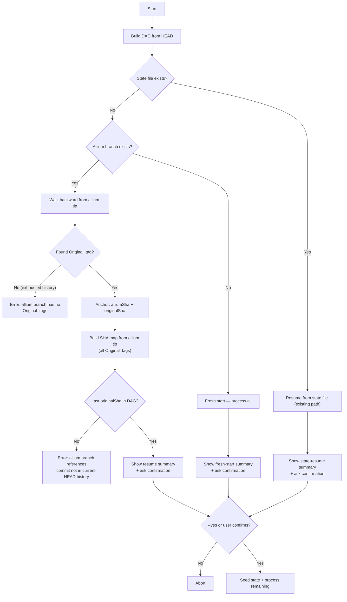

# Remove `--start-after` / `--seed-spec`, Auto-Resume from Allium Branch

## Motivation

The allium branch already records which original commit each allium commit corresponds to (via `Original: <sha>` in commit messages). Both `--start-after` and `--seed-spec` are redundant — the allium branch tip is the single source of truth for resume state.

## New Startup Flow




> **Design note — hard error on DAG divergence:** The `ErrorNotInDAG` path is intentional. Because step 5 reads the seed spec from the allium tip (which reflects all previously processed commits), silently falling back to an earlier DAG member would create a spec/DAG inconsistency — the seed spec would reference work done on commits no longer in the target history. A hard error forces the user to reconcile explicitly: restore the missing commits, delete the allium branch to start fresh, or rebase the allium branch to remove the orphaned commits.

## Allium Branch Resolution Algorithm

The allium branch tip may not always have an `Original:` tag (e.g., reconciliation commits). The resolver walks backward to find an anchor, then uses the SHA map to establish the full DAG correspondence:

1. **Walk backward** from allium branch tip, commit by commit (first-parent)
2. For each commit, attempt to parse the `Original:` tag
3. Stop at the first commit that has one — this is the **anchor** (`anchorAlliumSha`, `anchorOriginalSha`). Since we walk from tip backward, the anchor is the most recent commit with an `Original:` tag; no commits between the anchor and the tip carry one. Therefore `startAfterSha = anchorOriginalSha` directly.
4. **Build complete SHA map** from the allium tip via `buildShaMapFromAlliumBranch` (walks full history, collects all `Original:` mappings). This map is returned for orchestrator use (seeding segment progress, SHA lookups, etc.).
5. Read the **seed spec from the allium tip** (not the anchor), since the tip always has the most up-to-date state (even if it's a reconciliation commit)

## Files to Change

### 1. [src/config.ts](src/config.ts) — Remove `startAfter` and `seedSpecFrom`

- Delete `startAfter?: string` (line 19) and `seedSpecFrom?: string` (line 20) from `EvolutionConfig`
- Add `autoConfirm: boolean` to the interface
- Remove them from `defaultConfig`, add `autoConfirm: false` default

### 2. [src/cli.ts](src/cli.ts) — Update CLI options

- Remove `--start-after` option (line 16)
- Remove `--seed-spec` option (line 17)
- Add `--yes` / `-y` option ("Skip confirmation prompt")
- Remove the entire `startAfter` validation block (lines 56-89)
- Wire `autoConfirm: opts.yes` into config

### 3. [src/evolution/seed-resolver.ts](src/evolution/seed-resolver.ts) — Rewrite

- **Remove** `resolveSeedAlliumSha` entirely
- **Keep** `buildShaMapFromAlliumBranch` as-is (already walks full history and collects all `Original:` mappings)
- **Add** `resolveFromAlliumBranch(repoPath, alliumBranch)` — the new resolution function:
  1. Check if branch exists (`git rev-parse --verify refs/heads/<branch>`)
  2. If not, return `null` (fresh start)
  3. Get the tip SHA
  4. Walk backward from tip (via `git log --first-parent -n 100 --format="%H<<SEP>>%B<<REC>>"`) collecting allium SHAs in order. The `-n 100` cap prevents unbounded history traversal in pathological cases (see step 6).
  5. Parse `Original:` from each commit body; stop at first hit (the **anchor**)
  6. If no anchor found within the 100 returned commits, throw: `No Original: tag found in last 100 commits of allium branch '${alliumBranch}'. The branch may be corrupt or was not created by allium-evolve.`
  7. Build complete SHA map from tip via `buildShaMapFromAlliumBranch`
  8. Before returning, compute two additional fields: `commitsBeyondAnchor` (the number of allium commits walked before finding the anchor — already known from the step-4 loop index, i.e. 0 if the tip itself is the anchor) and `lastProcessedMessage` (via `git log -1 --format=%s <anchorOriginalSha>` against the repo — **catch git errors and return `null` for `lastProcessedMessage` on failure**, since `anchorOriginalSha` may reference a GC'd or unreachable commit; the orchestrator's DAG validation in section 4 step 2 is the correct place to surface that as a user-facing error). Return `{ tipAlliumSha, startAfterSha: anchorOriginalSha, shaMap, commitsBeyondAnchor, lastProcessedMessage }` where `lastProcessedMessage` is `string | null`.

### 4. [src/evolution/orchestrator.ts](src/evolution/orchestrator.ts) — Rewrite resume detection in `setupEvolution`

Replace the current `if (config.startAfter) { ... } else { ... }` block (lines 55-160) with:

1. Try to load state file first (existing fast-resume path — unchanged)
  - On parse error (corrupt, empty, or invalid JSON): log a warning including the file path (e.g., `"State file <path> exists but is unreadable, falling through to allium-branch detection"`), and fall through to step 2. Update `StateTracker.load()` to distinguish file-not-found (silent, return `false`) from parse failure (log warning, return `false`) so corruption is never silently swallowed.
  - **Validate state against DAG:** verify that `state.rootCommit` exists in the freshly-built DAG and that, for each segment with completed steps, the last `completedSteps[].originalSha` exists in the DAG. If any check fails, throw: `"State file references commits not in the current DAG (possible history rewrite). Delete the state file to restart, or restore the original history."`
2. If no state file, call `resolveFromAlliumBranch()`:
  - Returns `null` → fresh start (init empty state)
  - Returns `{ tipAlliumSha, startAfterSha, shaMap, commitsBeyondAnchor, lastProcessedMessage }` → validate `startAfterSha` is in the DAG, then seed state using existing `collectAncestors` + `seedSegmentProgress` logic (this is largely the same code as today, just driven by the resolver result instead of CLI params). If `startAfterSha` is not in the DAG, throw with a message suggesting: (1) restore the missing commits, (2) delete the allium branch to start fresh, or (3) rebase the allium branch to remove commits referencing the dropped originals.
  - Read seed spec from `tipAlliumSha` (the actual branch tip, which may differ from the commit containing the `Original:` tag)
3. `setupEvolution` returns a new `resumeInfo` field describing what was detected: `mode` (`'fresh' | 'state-file' | 'allium-branch'`), `totalCommits` (DAG size), `segmentCount` (number of segments), `completedSteps` (if resuming), and `remainingSteps` (if resuming). When `mode === 'allium-branch'`, also include: `tipAlliumSha`, `startAfterSha`, `lastProcessedMessage`, and `commitsBeyondAnchor` (all sourced from the resolver return). The allium branch name is read from `config.alliumBranch` at the `runEvolution` call site and need not be duplicated into `resumeInfo`.
4. `runEvolution` uses `resumeInfo` to display summary and prompt for confirmation (unless `config.autoConfirm`)

### 5. Add confirmation utility — [src/utils/confirm.ts](src/utils/confirm.ts)

Use Node's built-in `readline` (no new dependencies):

```typescript
import { createInterface } from "node:readline";

async function confirmContinue(message: string): Promise<boolean> {
  if (!process.stdin.isTTY) {
    throw new Error(
      "Non-interactive terminal detected — cannot prompt for confirmation. Use --yes to skip confirmation.",
    );
  }
  const rl = createInterface({ input: process.stdin, output: process.stderr });
  return new Promise((resolve) => {
    rl.question(`${message} [y/N] `, (answer) => {
      rl.close();
      resolve(answer.trim().toLowerCase() === "y");
    });
  });
}
```

Called in `runEvolution` after `setupEvolution` returns, showing:

- Resume vs fresh start
- Number of commits total, number already processed, number remaining
- Allium branch name (from `config.alliumBranch`), tip SHA, last-processed commit message, and tip-to-anchor distance (from `resumeInfo` allium-branch fields)

### 6. [src/git/read-spec.ts](src/git/read-spec.ts) — Update error message

- Line 18: Remove reference to `--start-after` and `--seed-spec` in the multi-file spec error message. Reword to mention the allium branch instead.

### 7. [test/unit/state-tracker.unit.test.ts](test/unit/state-tracker.unit.test.ts) — Update test config

- Remove `startAfter` references from `makeConfig` if present (currently not set, but the type will change)
- Update test description at line 421 that references `--start-after`

### 8. [src/state/tracker.ts](src/state/tracker.ts) — Distinguish parse failure from file-not-found in `load()`

Update `StateTracker.load()` so it distinguishes two failure modes:

- **File not found:** return `false` silently (current behaviour, unchanged)
- **Parse failure** (corrupt, empty, or invalid JSON): log a warning including the file path (e.g., `"State file <path> exists but is unreadable"`), then return `false`

This ensures corruption is never silently swallowed and aligns with the fallthrough logic in section 4 step 1. All other methods (`initState`, `setShaMap`, `seedSegmentProgress`, `updateBranchHead`) remain unchanged.

### 9. [test/unit/seed-resolver.unit.test.ts](test/unit/seed-resolver.unit.test.ts) — Rewrite for `resolveFromAlliumBranch`

The existing test imports `resolveSeedAlliumSha` which is being deleted. Replace both existing test cases with coverage for `resolveFromAlliumBranch`. Keep `buildShaMapFromAlliumBranch` test as-is (function is unchanged). Use the same temp-repo helper pattern (mkdtemp + git init + commits with `formatOriginalLine`).

**Test cases:**

- **"returns null when allium branch does not exist"** — create a repo with no allium branch, verify `resolveFromAlliumBranch` returns `null`
- **"resolves when tip commit has an Original: tag"** — allium branch tip directly contains `Original:` tag, verify correct `tipAlliumSha`, `startAfterSha`, `shaMap`, `commitsBeyondAnchor === 0` (tip is the anchor), and `lastProcessedMessage` is a non-empty string
- **"walks back when tip has no Original: tag"** — create allium branch where tip is a reconciliation commit (no `Original:` tag) but parent has one; verify anchor found via walk-back, `startAfterSha` is correct, `commitsBeyondAnchor === 1` (one commit walked past the anchor), and `lastProcessedMessage` is a non-empty string
- **"throws when branch exists but no commit has an Original: tag"** — allium branch with commits that have no `Original:` tags; verify descriptive error thrown
- **"shaMap contains all Original: mappings from full history"** — verify the returned `shaMap` has entries for all allium commits with `Original:` tags, not just the anchor

### 10. [test/integration/setup-only.integration.test.ts](test/integration/setup-only.integration.test.ts) — Add allium-branch auto-detect scenarios

Add new `describe` blocks alongside the existing fresh-start and state-resume tests:

**Test cases:**

- **"INT-SETUP-006: Auto-resume from allium branch seeds state correctly"** — pre-create an allium branch with `Original:` tagged commits in the fixture repo copy, then call `setupEvolution` without a state file. Verify `isResume === true`, segments are partially seeded, and `shaMap` is populated in state.
- **"INT-SETUP-007: autoConfirm bypasses prompt"** — set `config.autoConfirm = true`, verify `setupEvolution` + `runEvolution` path does not hang (no stdin read). This is a smoke test that the confirmation utility respects the flag.
- **"INT-SETUP-008: allium branch with no Original: tags produces clear error"** — create an allium branch where all commits lack `Original:` tags, verify `setupEvolution` throws with a message mentioning the missing tags.
- **"INT-SETUP-009: Corrupt state file falls through to allium-branch detection"** — write a state file containing invalid JSON (e.g., `{CORRUPT`) to the expected state-file path, pre-create an allium branch with valid `Original:` tagged commits, then call `setupEvolution`. Verify: (1) a warning is logged mentioning the file path and "unreadable", (2) setup does **not** throw, (3) `resumeInfo.mode === 'allium-branch'` (fell through to step 2 of section 4), and (4) state is correctly seeded from the allium branch — confirming the fallback path from section 4 bullet 1.
- **"INT-SETUP-010: State file referencing commits not in DAG throws"** — write a syntactically valid state file whose `rootCommit` or last `completedSteps[].originalSha` is a SHA not present in the fixture repo's DAG. Call `setupEvolution` and verify it throws with a message matching `"State file references commits not in the current DAG"` — confirming the DAG-validation guard from section 4 bullet 1 sub-point.
- **"INT-SETUP-011: Allium branch startAfterSha not in DAG throws"** — pre-create an allium branch whose most recent `Original:` tag references a SHA that is **not** an ancestor of HEAD (e.g., create a commit on a detached side branch, tag it in the allium branch, then reset HEAD so that commit is unreachable). Call `setupEvolution` without a state file and verify it throws with a message mentioning restoring missing commits, deleting the allium branch, or rebasing — confirming the `startAfterSha`-not-in-DAG guard from section 4 bullet 2. **Note:** this is distinct from INT-SETUP-008 (no `Original:` tags at all); here the tags exist but reference unreachable commits.

## Confirmation Prompt Output (examples)

**Allium branch resume:**

```
[allium-evolve] Resume detected from allium branch 'allium/evolution'
  Last processed: abc1234 "feat: add user auth"
  Allium tip:     def5678 (2 commits ahead of last Original: tag)
  Commits in DAG: 247
  Already done:   182
  Remaining:      65

Continue? [y/N]
```

**State file resume:**

```
[allium-evolve] Resume detected from state file
  Completed:  182 / 247 steps
  Cost so far: $4.2300

Continue? [y/N]
```

**Fresh start:**

```
[allium-evolve] Fresh start — no allium branch or state file found
  Commits in DAG: 247
  Segments:       12

Continue? [y/N]
```

