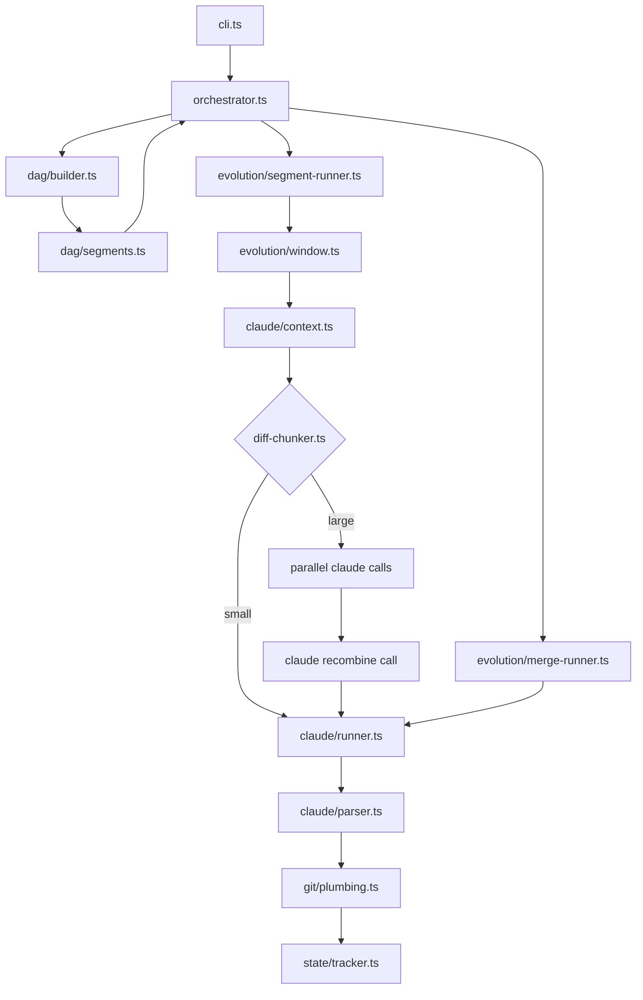

# allium-evolve

A standalone TypeScript CLI tool that distills an evolving [Allium](https://github.com/your-org/allium) specification from any git repository's commit history. It replays commits through Claude to produce a parallel git branch containing the domain specification at each point in time.

## How it works

1. **DAG analysis** -- Parses the full git history into a commit DAG, identifies the trunk (first-parent walk), and decomposes the graph into linear segments with fork/merge points and topological ordering.
2. **Sliding window** -- Walks each segment with a configurable window. Tail commits get full diffs; older window commits provide message-only context.
3. **Claude CLI distillation** -- Each step invokes `claude -p` with the previous spec + diffs. Opus handles initial commits and merges; Sonnet handles standard evolution steps. Large diffs are chunked by package directory and processed in parallel sub-agent calls, then recombined.
4. **Parallel git history** -- Creates a mirrored allium branch using git plumbing (isolated temp indexes, no working tree changes). Merge topology is preserved. Independent segments run concurrently by default.
5. **Resumability** -- A JSON state file tracks progress per segment. Failures resume from the exact failed step, not the beginning.

## Prerequisites

- **Node.js** >= 23.6 (required for native `--import tsx` loader)
- **Claude CLI** installed and authenticated (`claude` command available on PATH)
- **pnpm** package manager
- **Git** repository to analyze

## Installation

```bash
cd ~/workspace/allium-evolve
pnpm install
```

## Usage

```bash
node --import tsx src/cli.ts \
  --repo /path/to/repo \
  --ref HEAD \
  --window-size 5 \
  --process-depth 1 \
  --model sonnet \
  --opus-model opus \
  --max-diff-tokens 80000 \
  --allium-branch allium/evolution \
  --state-file .allium-state.json
```

Or via the `start` script:

```bash
pnpm start -- --repo /path/to/repo
```

Disable parallel branch processing for deterministic replay:

```bash
node --import tsx src/cli.ts --repo /path/to/repo --no-parallel-branches
```

## Configuration reference

| Option | CLI flag | Type | Default | Description |
|---|---|---|---|---|
| `repoPath` | `--repo` (required) | `string` | `process.cwd()` | Path to the git repository to analyze |
| `targetRef` | `--ref` | `string` | `HEAD` | Git ref to walk back from |
| `windowSize` | `--window-size` | `number` | `5` | Number of commits in the sliding window |
| `processDepth` | `--process-depth` | `number` | `1` | Number of tail commits that get full diffs (rest get message-only context) |
| `defaultModel` | `--model` | `string` | `sonnet` | Claude model for standard evolution steps |
| `opusModel` | `--opus-model` | `string` | `opus` | Claude model for initial commits and merges |
| `maxDiffTokens` | `--max-diff-tokens` | `number` | `80000` | Token threshold before diff chunking kicks in |
| `parallelBranches` | `--parallel-branches` / `--no-parallel-branches` | `boolean` | `true` | Process independent segments concurrently |
| `maxConcurrency` | `--max-concurrency` | `number` | `4` | Max parallel segment runners |
| `stateFile` | `--state-file` | `string` | `.allium-state.json` | Path to the JSON state file for resumability |
| `alliumBranch` | `--allium-branch` | `string` | `allium/evolution` | Name of the output git branch |
| `maxParseRetries` | `--max-parse-retries` | `number` | `2` | Retries for Claude response parser validation failures |
| `diffIgnorePatterns` | (config only) | `string[]` | `["*-lock.*", "*.min.*", "*.generated.*"]` | Glob patterns for files to exclude from diffs |
| `alliumSkillsPath` | `--allium-skills-path` | `string` | `~/.claude/skills/allium` | Path to Allium skills directory (passed as `--add-dir` to Claude) |

## Architecture



### Module overview

| Module | Purpose |
|---|---|
| `src/cli.ts` | Commander entry point, argument parsing |
| `src/config.ts` | `EvolutionConfig` interface and defaults |
| `src/dag/` | Git log parsing, DAG construction, trunk identification, segment decomposition |
| `src/evolution/orchestrator.ts` | Main loop: walks segments in topo order, dispatches runners, synchronizes at merges |
| `src/evolution/segment-runner.ts` | Processes a linear segment with sliding window, invokes Claude per step |
| `src/evolution/merge-runner.ts` | Reconciles trunk + branch specs at merge commits (Opus) |
| `src/evolution/window.ts` | Sliding window state and advance logic |
| `src/evolution/diff-chunker.ts` | Splits large diffs by package, dispatches parallel sub-agents, recombines |
| `src/claude/runner.ts` | Claude CLI invocation wrapper (`claude -p` with structured JSON output) |
| `src/claude/context.ts` | Assembles prompt context from window state |
| `src/claude/parser.ts` | Extracts and validates structured JSON from Claude responses |
| `src/claude/models.ts` | Model selection per step type (Opus for initial/merge, Sonnet for evolve) |
| `src/git/plumbing.ts` | Git plumbing: `commit-tree`, `read-tree`, `write-tree`, `update-ref` with isolated temp indexes |
| `src/git/diff.ts` | Diff and diffstat extraction between SHAs |
| `src/git/log.ts` | Parses `git log` output into `CommitNode[]` |
| `src/state/tracker.ts` | State file read/write, resume logic, centralized state serialization |
| `src/utils/tokens.ts` | Token count estimation (tiktoken) |
| `src/utils/exec.ts` | Async `child_process` wrapper |
| `prompts/` | Prompt templates: `evolve-step.md`, `initial-commit.md`, `merge-specs.md`, `recombine-chunks.md` |

## Development

### Run tests

```bash
pnpm test              # all tests
pnpm test:unit         # unit tests only
pnpm test:integration  # integration tests only
pnpm test:coverage     # with coverage report
pnpm test:watch        # watch mode
```

### Type check

```bash
pnpm type-check
```

### Create fixture repo

Builds a small git repo with known topology (~15 commits, 3 branches, merges) for testing:

```bash
pnpm fixture
```

Output goes to `test/fixtures/repo/` (gitignored).

## Resumability

The state file (default: `.allium-state.json`) persists progress after every step. It tracks:

- Completed steps per segment (original SHA -> allium SHA mapping)
- Current spec and changelog per segment
- Merge history
- Cumulative cost

On failure, re-run the same command. The tool loads existing state, skips completed segments/steps, rebuilds the sliding window from the last completed steps, and retries only the failed step. Failed segments are retried individually -- the entire segment does not restart.

Delete the state file to start fresh.
